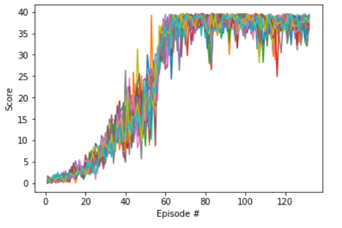

# Report: Deep Reinforcement Learning Nanodegree Project 2 Continuous Control
### DDPG

In the implementation, the DDPG is utilized.
- DDPG is a model-free off-policy algorithm for learning continuous actions. It contains an **actor network** and a **critic network**. The DDPG is capable of dealing with continuous action domain. The algorithm is listed below:

### Network Architectures
The **actor network** and **critic network** include input layer(33), 2 hidden layer(256,128) and the output layer(4). DDPG require a target and local network for both **actor network** and **critic network**. Target and local network have same structures. 

### Hyperparameters
In this deep network, the hyperparameters are listed as follows:
- Learning rate for actor= 1e-4
- Learning rate for critic 1e-3
- discount factor = 0.99
- buffer size = 1e5
- batch size = 128

### Plots of Rewards

### Idea for future work
To further improve the performance of the agent, we have a few options:
- GAE
- A3C
- PPO
